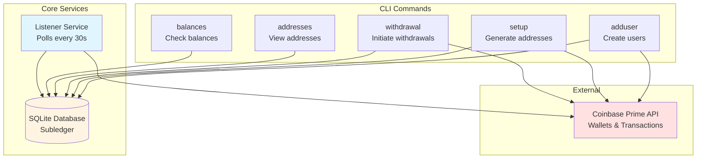
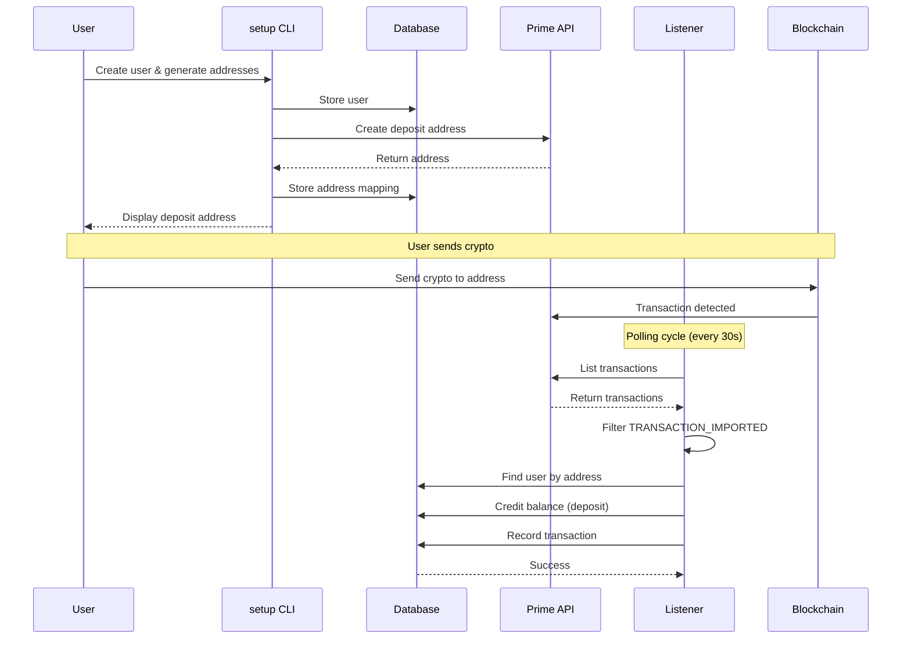
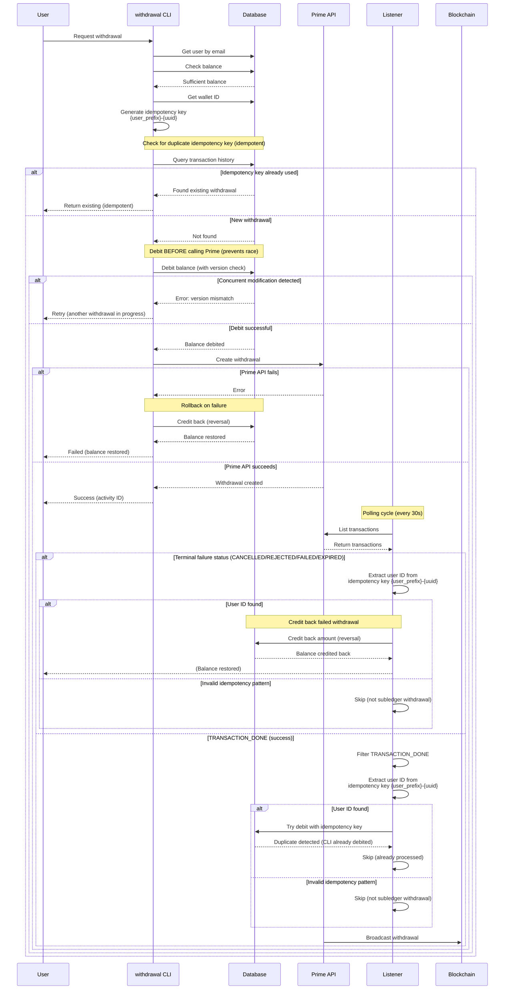
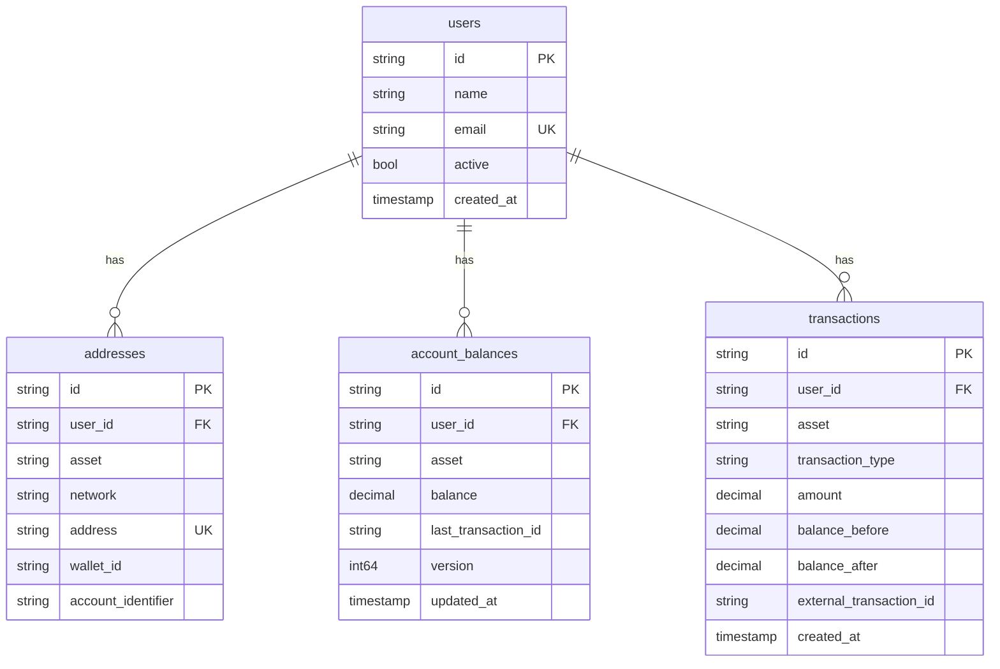

# Architecture - Option A: Component Diagrams with Separate Flows

## System Architecture

```mermaid
graph TB
    subgraph "CLI Commands"
        AddUser[adduser<br/>Create users]
        Setup[setup<br/>Generate addresses]
        Withdrawal[withdrawal<br/>Initiate withdrawals]
        Addresses[addresses<br/>View addresses]
        Balances[balances<br/>Check balances]
    end

    subgraph "Core Services"
        Listener[Listener Service<br/>Polls every 30s]
        DB[(SQLite Database<br/>Subledger)]
    end

    subgraph "External"
        Prime[Coinbase Prime API<br/>Wallets & Transactions]
    end

    AddUser --> DB
    AddUser --> Prime
    Setup --> DB
    Setup --> Prime
    Withdrawal --> DB
    Withdrawal --> Prime
    Addresses --> DB
    Balances --> DB

    Listener --> Prime
    Listener --> DB

    style Listener fill:#e1f5ff
    style DB fill:#fff4e1
    style Prime fill:#ffe1e1
```

## Deposit Flow

```mermaid
sequenceDiagram
    participant User
    participant Setup as setup CLI
    participant DB as Database
    participant Prime as Prime API
    participant Listener
    participant Blockchain

    User->>Setup: Create user & generate addresses
    Setup->>DB: Store user
    Setup->>Prime: Create deposit address
    Prime-->>Setup: Return address
    Setup->>DB: Store address mapping
    Setup-->>User: Display deposit address

    Note over User,Blockchain: User sends crypto
    User->>Blockchain: Send crypto to address
    Blockchain->>Prime: Transaction detected

    Note over Listener: Polling cycle (every 30s)
    Listener->>Prime: List transactions
    Prime-->>Listener: Return transactions
    Listener->>Listener: Filter TRANSACTION_IMPORTED
    Listener->>DB: Find user by address
    Listener->>DB: Credit balance (deposit)
    Listener->>DB: Record transaction
    DB-->>Listener: Success
```

## Withdrawal Flow

```mermaid
sequenceDiagram
    participant User
    participant Withdrawal as withdrawal CLI
    participant DB as Database
    participant Prime as Prime API
    participant Listener
    participant Blockchain

    User->>Withdrawal: Request withdrawal
    Withdrawal->>DB: Get user by email
    Withdrawal->>DB: Check balance
    DB-->>Withdrawal: Sufficient balance
    Withdrawal->>DB: Get wallet ID
    Withdrawal->>Withdrawal: Generate idempotency key<br/>{user_prefix}-{uuid}

    Note over Withdrawal,DB: Check for duplicate idempotency key (idempotent)
    Withdrawal->>DB: Query transaction history
    alt Idempotency key already used
        DB-->>Withdrawal: Found existing withdrawal
        Withdrawal-->>User: Return existing (idempotent)
    else New withdrawal
        DB-->>Withdrawal: Not found

        Note over Withdrawal,DB: Debit BEFORE calling Prime (prevents race)
        Withdrawal->>DB: Debit balance (with version check)
        alt Concurrent modification detected
            DB-->>Withdrawal: Error: version mismatch
            Withdrawal-->>User: Retry (another withdrawal in progress)
        else Debit successful
            DB-->>Withdrawal: Balance debited

            Withdrawal->>Prime: Create withdrawal
            alt Prime API fails
                Prime-->>Withdrawal: Error
                Note over Withdrawal,DB: Rollback on failure
                Withdrawal->>DB: Credit back (reversal)
                DB-->>Withdrawal: Balance restored
                Withdrawal-->>User: Failed (balance restored)
            else Prime API succeeds
                Prime-->>Withdrawal: Withdrawal created
                Withdrawal-->>User: Success (activity ID)

                Note over Listener: Polling cycle (every 30s)
                Listener->>Prime: List transactions
                Prime-->>Listener: Return transactions

                alt Terminal failure status (CANCELLED/REJECTED/FAILED/EXPIRED)
                    Listener->>Listener: Extract user ID from<br/>idempotency key {user_prefix}-{uuid}
                    alt User ID found
                        Note over Listener,DB: Credit back failed withdrawal
                        Listener->>DB: Credit back amount (reversal)
                        DB-->>Listener: Balance credited back
                        Listener-->>User: (Balance restored)
                    else Invalid idempotency pattern
                        Listener->>Listener: Skip (not subledger withdrawal)
                    end
                else TRANSACTION_DONE (success)
                    Listener->>Listener: Filter TRANSACTION_DONE
                    Listener->>Listener: Extract user ID from<br/>idempotency key {user_prefix}-{uuid}
                    alt User ID found
                        Listener->>DB: Try debit with idempotency key
                        DB-->>Listener: Duplicate detected (CLI already debited)
                        Listener->>Listener: Skip (already processed)
                    else Invalid idempotency pattern
                        Listener->>Listener: Skip (not subledger withdrawal)
                    end

                    Prime->>Blockchain: Broadcast withdrawal
                end
            end
        end
    end
```

## Database Schema

```mermaid
erDiagram
    users ||--o{ addresses : "has"
    users ||--o{ account_balances : "has"
    users ||--o{ transactions : "has"

    users {
        string id PK
        string name
        string email UK
        bool active
        timestamp created_at
    }

    addresses {
        string id PK
        string user_id FK
        string asset
        string network
        string address UK
        string wallet_id
        string account_identifier
    }

    account_balances {
        string id PK
        string user_id FK
        string asset
        decimal balance
        string last_transaction_id
        int64 version
        timestamp updated_at
    }

    transactions {
        string id PK
        string user_id FK
        string asset
        string transaction_type
        decimal amount
        decimal balance_before
        decimal balance_after
        string external_transaction_id
        timestamp created_at
    }
```
