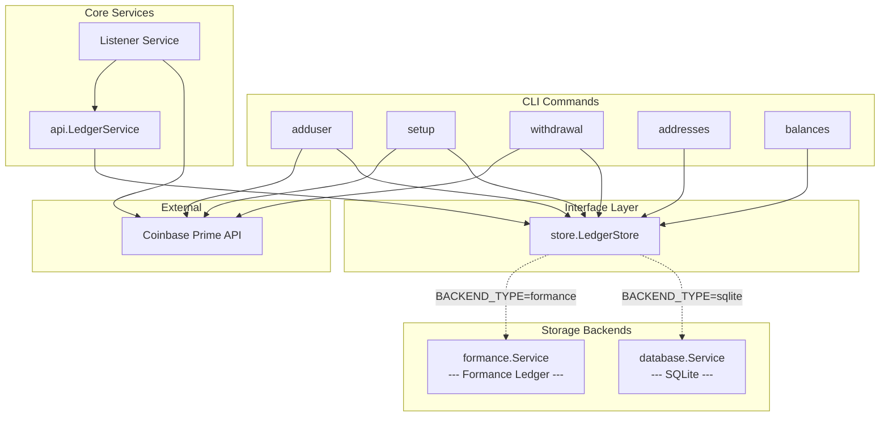
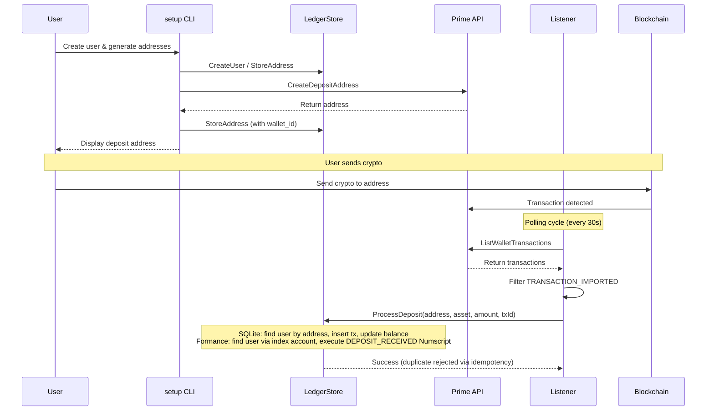
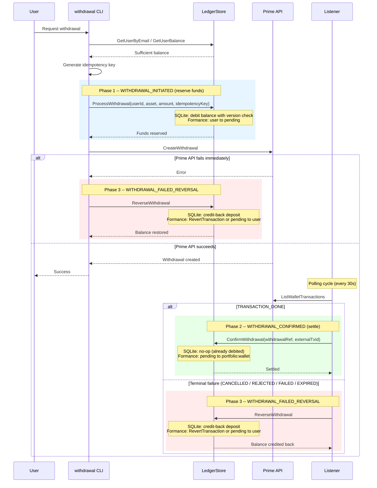
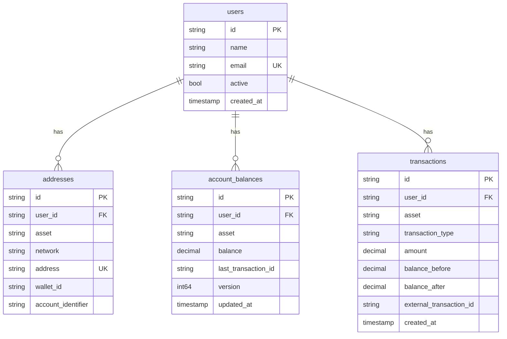
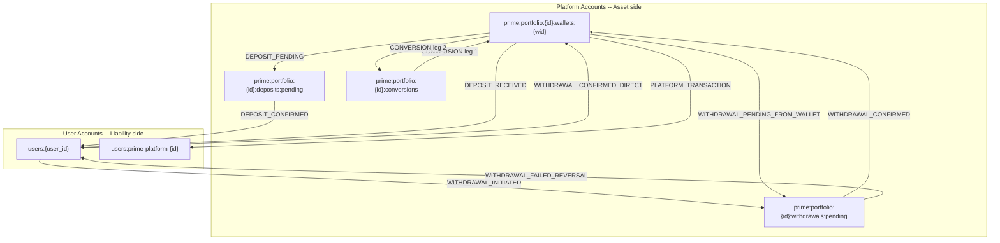

# Architecture

## System Overview

The system is a custodial crypto deposit/withdrawal platform backed by Coinbase Prime. A listener service polls the Prime API for transactions and credits or debits user accounts through a pluggable storage backend.

Two storage backends are supported, selectable via the `BACKEND_TYPE` environment variable:

| | SQLite | Formance Ledger |
|---|---|---|
| **Type** | Embedded relational database | Remote double-entry ledger service |
| **Accounting model** | Single-entry with bolt-on journal | Native double-entry by construction |
| **Balance storage** | Separate `account_balances` table with optimistic locking | Computed from postings (no balance table) |
| **Idempotency** | SQL duplicate check on `external_transaction_id` | Native `reference` field on transactions |
| **Concurrency** | `version` column + `BEGIN`/`COMMIT` | Atomic Numscript execution |
| **Audit trail** | `balance_before`/`balance_after` per row | Immutable transaction log; balances consistent by construction |
| **Reconciliation** | `SUM(transactions)` vs stored balance | Not needed -- single source of truth |
| **Deployment** | Zero dependencies (single file) | Requires a running Formance Stack |

---

## High-Level Component Diagram



The `store.LedgerStore` interface defines 16 methods covering users, addresses, balances, and transactions. Both backends implement the full interface, so every CLI command and the listener work identically regardless of which backend is active.

---

## Deposit Flow



---

## Withdrawal Flow

The withdrawal lifecycle follows a three-phase pattern. With Formance, each phase is a distinct ledger transaction with funds explicitly tracked through a `prime:withdrawals:pending` account. With SQLite, the balance is debited immediately and confirmation is a no-op.



### Withdrawal phases at a glance

| Phase | Event | SQLite | Formance |
|---|---|---|---|
| 1. Reserve | `WITHDRAWAL_INITIATED` | Debit `account_balances` directly | `users:{id}` to `prime:portfolio:{id}:withdrawals:pending` |
| 2. Settle | `WITHDRAWAL_CONFIRMED` | No-op (balance already debited) | `prime:portfolio:{id}:withdrawals:pending` to `prime:portfolio:{id}:wallets:{wid}` |
| 2b. Direct | `WITHDRAWAL_CONFIRMED_DIRECT` | N/A | `users:{id}` (with overdraft) to `prime:portfolio:{id}:wallets:{wid}` |
| 3. Reverse | `WITHDRAWAL_FAILED_REVERSAL` | Credit-back deposit | `prime:portfolio:{id}:withdrawals:pending` to `users:{id}` |

With Formance, the `prime:withdrawals:pending` account balance at any point in time represents the total value of in-flight withdrawals that have been submitted to Coinbase Prime but not yet confirmed or failed on-chain. This gives operations teams immediate visibility into outstanding settlement risk.

---

## Storage Backend: SQLite

SQLite uses a traditional relational model with four tables. Bookkeeping is single-entry at its core: each transaction records an amount, and a separate `account_balances` table caches the current state. An optional `journal_entries` table bolts on double-entry semantics after the fact.

### Schema



### How it works

- **User creation**: The `CREATE_DUMMY_USERS=true` flag inserts three test users during schema initialization. This is SQLite-specific -- it has no effect when using the Formance backend (users must be created via `cmd/adduser` instead).
- **Address creation**: The `cmd/setup` CLI reads users from the store, calls the Coinbase Prime API to generate a deposit address per user/asset/network, and stores the mapping via `StoreAddress()`. This works identically for both backends.
- **Balance updates** are explicit: every `ProcessDeposit` / `ProcessWithdrawal` reads the current row from `account_balances`, computes the new value, and writes it back within a SQL transaction using optimistic locking (`WHERE version = ?`).
- **Idempotency** is enforced by checking `external_transaction_id` before inserting.
- **Reconciliation** is a separate function that compares `SUM(transactions.amount)` against the cached `account_balances.balance` -- they can drift if there's a bug.
- **Journal entries** (double-entry) are appended in `addJournalEntries()` as a secondary step; they don't drive any balance logic.

### Benefits

- Zero deployment overhead -- single embedded file, no external services.
- Fast local reads -- all data on disk, no network round-trips.
- Simple to inspect and debug (`sqlite3 addresses.db "SELECT ..."`).
- Works offline -- no connectivity required for balance queries or history lookups.

### Trade-offs

- Balance and transaction history can diverge if the application crashes between writes.
- Concurrency limited to SQLite's single-writer model; optimistic locking is bolted on at the application layer.
- Double-entry bookkeeping is an afterthought (`addJournalEntries`) rather than a structural guarantee.

---

## Storage Backend: Formance Ledger

Formance is a purpose-built double-entry ledger. Every operation is expressed as a Numscript transaction that atomically moves funds between accounts. Balances are never stored separately -- they are computed from the sum of all postings to an account.

### Account Model and Fund Flows

All user accounts are flat (`users:{user_id}`) -- no per-network sub-accounts. Network information is captured in transaction metadata only, matching how Coinbase Prime treats wallets (unified balance across networks).



| Account | Purpose |
|---|---|
| `prime:portfolio:{id}:wallets:{wid}` | Omnibus Prime wallet (one per asset) |
| `prime:portfolio:{id}:deposits:pending` | In-flight deposits not yet confirmed |
| `prime:portfolio:{id}:withdrawals:pending` | In-flight withdrawals not yet settled |
| `prime:portfolio:{id}:conversions` | Conversion clearing account |
| `users:{user_id}` | End-user account (all assets, flat) |
| `users:prime-platform-{id}` | Platform catch-all for unattributed transactions |

### 10 Event Types

| # | Event | Source | Destination | Overdraft |
|---|---|---|---|---|
| 1 | DEPOSIT_PENDING | wallet | deposits:pending | source |
| 2 | DEPOSIT_CONFIRMED | deposits:pending | user | -- |
| 3 | DEPOSIT_RECEIVED | wallet | user | source |
| 4 | WITHDRAWAL_INITIATED | user | withdrawals:pending | -- |
| 5 | WITHDRAWAL_PENDING_FROM_WALLET | wallet | withdrawals:pending | source |
| 6 | WITHDRAWAL_CONFIRMED | withdrawals:pending | wallet | -- |
| 7 | WITHDRAWAL_CONFIRMED_DIRECT | user | wallet | source |
| 8 | WITHDRAWAL_FAILED_REVERSAL | withdrawals:pending | user | source |
| 9 | CONVERSION (2 legs) | conversions / wallet | wallet / conversions | source |
| 10 | PLATFORM_TRANSACTION | wallet | platform user | source |

### How it works

- **Balances** are fetched via `GetAccount` with `expand=volumes` on `users:{userId}`. Single API call per user, no aggregation needed.
- **Idempotency** uses Formance's native `reference` field. Duplicates return `CONFLICT`, mapped to `store.ErrDuplicateTransaction`.
- **Reconciliation** is a no-op -- balances are consistent by construction.
- **Users and addresses** stored as metadata on `users:{userId}`. Deposit addresses: `deposit_addr_{address}={asset}`. Withdrawal addresses: `withdrawal_addr_{address}={asset}`.
- **User lookup** via `FindUserByAddress`: `ListAccounts` with `$or` query across both deposit and withdrawal address keys.
- **Pending check** via `HasPendingWithdrawal`: `ListTransactions` with `metadata[withdrawal_ref]` filter.
- **Immediate rollback** via Formance native `RevertTransaction` API (looks up by `metadata[withdrawal_ref]`).

### Benefits

- True double-entry accounting by construction -- every Numscript `send` is an atomic debit/credit pair. There is no way to credit one account without debiting another.
- Balances are computed from postings, not cached. They cannot drift, go stale, or disagree with the transaction log. Reconciliation is structurally unnecessary.
- Immutable, append-only transaction log provides a complete audit trail out of the box.
- Native idempotency via the `reference` field -- duplicate submissions are rejected at the ledger level without application-side duplicate checks.
- Atomic execution -- a Numscript transaction either fully succeeds or has no effect. No partial writes, no manual rollback code, no version-column locking.
- Rich metadata on accounts and transactions enables flexible querying, reporting, and operational tooling through the Formance Console.
- Three-phase withdrawal pattern (reserve, settle, reverse) prevents double-spending at the ledger level rather than relying on application logic.
- Eliminates ~400 lines of manual bookkeeping code (balance caching, optimistic locking, journal entries, reconciliation).

### Trade-offs

- Requires a running Formance Stack (cloud-hosted sandbox or self-hosted).
- Balance queries require an API call per user (vs. local SQLite query).

---

## Interface Contract

Both backends implement the `store.LedgerStore` interface. The rest of the application is backend-agnostic.

```go
type LedgerStore interface {
    // Users
    GetUsers / GetUserById / GetUserByEmail / CreateUser

    // Addresses
    StoreAddress / GetAddresses / GetAllUserAddresses / FindUserByAddress

    // Balances
    GetUserBalance / GetAllUserBalances

    // Deposits
    ProcessDepositPending                   // DEPOSIT_PENDING
    ConfirmDeposit                          // DEPOSIT_CONFIRMED
    ProcessDeposit                          // DEPOSIT_RECEIVED (direct)

    // Withdrawals
    ProcessWithdrawal                       // WITHDRAWAL_INITIATED
    ProcessWithdrawalFromWallet             // WITHDRAWAL_PENDING_FROM_WALLET
    ConfirmWithdrawal                       // WITHDRAWAL_CONFIRMED
    ConfirmWithdrawalDirect                 // WITHDRAWAL_CONFIRMED_DIRECT
    ReverseWithdrawal                       // WITHDRAWAL_FAILED_REVERSAL
    HasPendingWithdrawal                    // Pre-flight check
    RevertTransaction                       // Native revert (Formance)

    // Platform
    RecordPlatformTransaction               // PLATFORM_TRANSACTION
    RecordConversion                        // CONVERSION

    // Queries
    GetTransactionHistory / GetMostRecentTransactionTime
    ReconcileUserBalance

    // Lifecycle
    Close()
}
```

Backend selection happens once at startup in `common.InitializeServices()` based on the `BACKEND_TYPE` environment variable (`sqlite` or `formance`). All downstream code -- CLI commands, the API service layer, and the listener -- operate exclusively through this interface.
